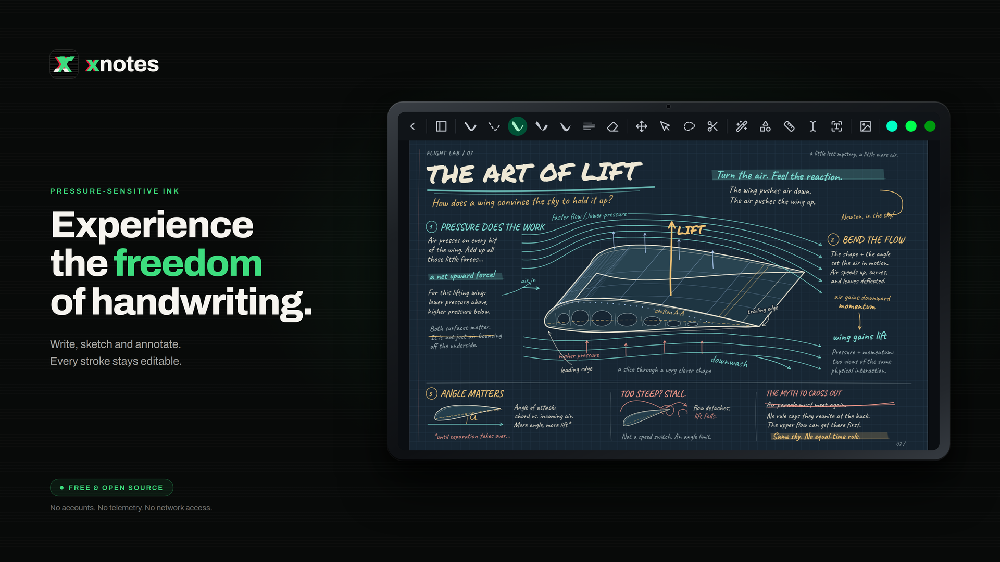
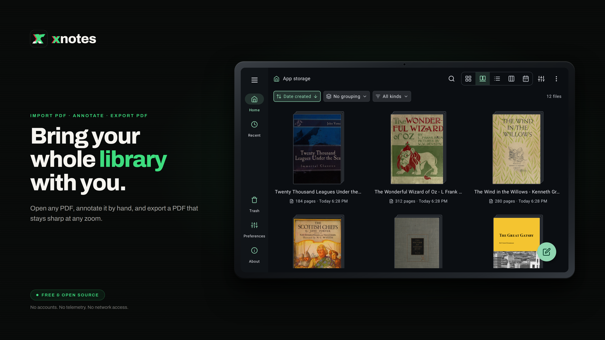

<p align="center">
  
</p>

<h1 align="center">xnotes</h1>

<p align="center">
  A handwriting-first notebook for Android, built for pen and stylus
</p>

<p align="center">
  <a href="https://github.com/shardulvs/xnotes-android/releases/latest"></a>
  <a href="https://f-droid.org/en/packages/com.xnotes"></a>
  <a href="LICENSE"></a>
  
  <a href="https://github.com/sponsors/shardulvs"></a>
</p>

<p align="center">
  <a href="https://github.com/shardulvs/xnotes-android/releases/latest">GitHub Releases</a> &bull;
  <a href="https://f-droid.org/en/packages/com.xnotes">F-Droid</a> &bull;
  <a href="https://play.google.com/store/apps/details?id=com.xnotes">Google Play</a>
</p>

<p align="center">
  <a href="https://f-droid.org/en/packages/com.xnotes"></a>
  <a href="https://play.google.com/store/apps/details?id=com.xnotes"></a>
</p>

<p align="center">
  
  <br />
  <em>Annotating a PDF in dark mode with pages inverted</em>
</p>

<p align="center">
  
  <br />
  <em>Browsing your notes and imported PDFs</em>
</p>

---

## At a glance

- **Pressure-sensitive ink**: a custom stroke engine turns raw stylus samples into a smooth, variable-width ribbon that swells and tapers with pen pressure, so handwriting and sketches feel natural instead of like a flat marker.
- **Vector PDF, in and out**: drop in a PDF as a page background to annotate, then export your notes back to PDF as true vector: ink and text stay crisp at any zoom instead of being flattened to pixels.
- **Razor-sharp deep zoom**: a background renderer redraws a high-resolution viewport off the main thread, so you can zoom far in and the ink stays sharp rather than turning blocky.
- **Real highlighter blending**: highlighters are composited live every frame with a true multiply blend, so overlapping strokes deepen like real ink instead of painting over one another.
- **Neon pen**: a glowing pen with a bright white core and saturated, luminous edges for accents that pop off the page.
- **Smart PDF dark mode**: invert a PDF page for comfortable night reading while leaving embedded photos and images untouched.
- **Nothing is ever flattened**: every stroke is stored as editable vector data in the open `.xnote` format, so you can re-select, move, restyle, or erase any mark at any time.
- **Stylus-aware by design**: pen and finger are handled separately, so you can pan with a finger while you draw with the pen; on devices without a stylus, finger drawing turns on automatically.
- **Private and open**: open source, no accounts, no telemetry, no network access at all. Files go through Android's Storage Access Framework, so the app needs no broad storage permission either.

## Install

| Channel | |
|---|---|
| [GitHub Releases](https://github.com/shardulvs/xnotes-android/releases/latest) | Signed APK |
| [F-Droid](https://f-droid.org/en/packages/com.xnotes) | Built reproducibly from source |
| [Google Play](https://play.google.com/store/apps/details?id=com.xnotes) | Automatic updates |

GitHub Releases and F-Droid ship the same signed APK. F-Droid rebuilds from source and verifies it against the GitHub release, so you can switch between those two without reinstalling.

## Build from source

Requires **JDK 17** (the project pins Java 17):

```bash
git clone https://github.com/shardulvs/xnotes-android.git
cd xnotes-android
JAVA_HOME=/path/to/jdk-17 ./gradlew assembleDebug
```

Output: `app/build/outputs/apk/debug/app-debug.apk`
